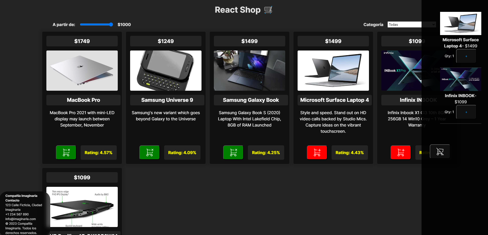

# Enunciando

1.Ecommerce

-Muestra una lista de productos que vienen de un JSON

-Añade un filter por categoría
-Añade un filtro por precio

Haz uso de useContext para evitar pasar por props inncesarias

2. Shopping Cart

-Haz que se puedan añadir productos al carrito
-Haz que se puedan eliminar los productos del carrito
-Haz que se puedaan modicar la cantidad de productos del carrito
-Sincronizar los cambios del carrito con la lista de productos
-Guarda en un localStorage el carrito para que se recupere al recagar la página

